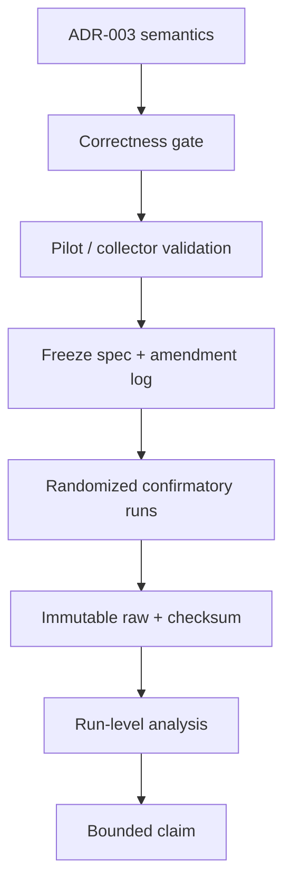

# Core Benchmark Protocol

> [!warning] Draft until pilot + advisor sign-off
> Specifications are promises made before seeing confirmatory numbers. Confirmatory data collected before status **ready** cannot be used as preregistered evidence.

^protocol-status

## Protocol stack

## Required manifest

- experiment/spec version;
- repository commit + dirty flag;
- build configuration and target framework;
- CPU/RAM/OS/kernel/runtime;
- affinity, power/governor and collector;
- backend/config/capacity/layout sizes;
- live dataset, occupancy, seed and initial checksum;
- workload/replay hash and actual operation success ratios;
- workers, warm-up and measurement duration;
- realized randomized order;
- command, timestamp, raw path/SHA-256;
- final correctness checksum and validity decision.

See [[./Benchmark Environment and Provenance|Benchmark Environment and Provenance]].

## Global run rules

1. Fresh process per cell × repetition.
2. Setup and teardown outside timed region.
3. Warm-up exercises the same code paths as measurement.
4. Randomize within blocks; preserve realized order.
5. One run produces one immutable manifest and raw bundle.
6. Failed/invalid runs remain visible with reason.
7. Pilot and confirmatory data are never pooled.
8. No extension matrix until core analysis is complete.

## Latency integrity

- Closed-loop state operation latency: deterministic sampling, one histogram/run.
- End-to-end/open-loop replay: collector must detect/correct coordinated omission or document why not applicable.
- Report sample count and histogram bounds.
- Validate collector overhead; do not allocate per operation in timed path.

## Statistical integrity

- Independent process run is the unit of replication.
- Report distribution and effect sizes, not only p-values.
- Bootstrap is performed over run-level metrics.
- Show all cells and all valid runs.
- Multiple co-primary metrics are interpreted jointly as trade-off/Pareto results.
- Practical thresholds are frozen before confirmatory execution.

## Baseline fairness

> [!success]
> [[./ADR-003 - Baseline Semantics and Fairness|ADR-003]] is mandatory. Dictionary is not a concurrent baseline. Same traces, outcomes, payloads and reserved capacity accounting are required.

## Threat → mitigation

| Threat | Mitigation |
|---|---|
| JIT/tiered compilation | explicit warm-up + steady-state pilot |
| GC/allocator carry-over | fresh process; capture GC mode/events |
| CPU scheduling/background noise | affinity + randomized blocks + repetitions |
| thermal/power drift | fixed plan; telemetry/bounds from pilot |
| cache state/order effect | fresh process + randomized order |
| semantics mismatch | differential/concurrency gate |
| cherry-picking | pre-registered exclusions + all-run plots |
| pseudo-replication | run-level statistics |
| mechanism overclaim | separate EXP-003 ablation/counters |
| external-validity overclaim | UPF-like boundary stated explicitly |

## Amendment log

| Timestamp | Before data? | Change | Reason | Approved by |
|---|---|---|---|---|
| 2026-09-16 | yes | Initial focused protocol | scope hardening | pending GVHD |

## Specs

- [[./EXP-001 - Baseline Throughput and Latency|EXP-001 — Core trade-off]]
- [[./EXP-003 - Compact Layout Mechanism Ablation|EXP-003 — Mechanism]]
- [[./EXP-002 - UPF End-to-End Backend Impact|EXP-002 — End-to-end]]
