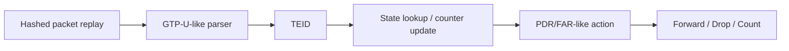

# EXP-002 — UPF-like End-to-End Backend Impact

> [!warning] Planned
> Chỉ chạy sau EXP-001 core và UPF-like correctness fixtures. Null backend là cost-decomposition ablation, không phải same-semantics production baseline.

## Objective

Measure whether a backend difference survives in a controlled packet pipeline when parser, rules, traffic, runtime and scheduling remain fixed.

## System under test

No kernel/NIC throughput claim is made: the core experiment uses an in-process deterministic replay so backend is isolatable.

## Factors

| Dimension | Core values |
|---|---|
| Backend | Null cost ablation; ConcurrentDictionary; VstState |
| Live sessions | 100K; 1M |
| Packet payload | 128 B; 1200 B |
| Worker count | 1; 8 |
| Control regime | stable rules; 99 packet operations : 1 rule insert/update/delete |
| Warm-up / measurement | 10 s / 30 s |
| Repetitions | 10 fresh processes/cell |
| Replay | identical packet/rule hash and seed |

Every packet performs TEID extraction, state access, action selection and accounting. Exact counter semantics must be identical for the two real backends.

## Primary outcomes

- packet throughput (packets/s);
- end-to-end p99 processing latency;
- CPU time/cycles per packet where collector support is reliable.

Secondary: drop/forward counts, checksum, allocation/GC, percentage gap from Null ablation.

## Analysis

- Run-level median/IQR + 95% bootstrap CI over 10 runs.
- Backend effect is shown both absolute and relative to the non-state portion estimated by Null ablation.
- Relate EXP-001 state-operation cost to end-to-end change using Amdahl-style decomposition.
- If backend effect is below the pre-approved practical threshold, H-04 is refuted/inconclusive rather than reframed.

## Validity controls

- Same parser/action binary and rule fixture.
- Same replay order/hash.
- Same logical outputs and final checksum.
- Collector overhead measured with instrumentation on/off.
- No claim of 3GPP conformance or line-rate NIC behavior.
- Packet generation is outside timed processing unless the design explicitly times both for every backend.

## Readiness

- [ ] UPF-like functional tests pass.
- [ ] Rule/action semantics documented.
- [ ] Backend adapters pass ADR-003 contract.
- [ ] Replay fixture + expected outputs versioned.
- [ ] Null ablation cannot be confused with correctness baseline.
- [ ] Practical threshold approved before run.
