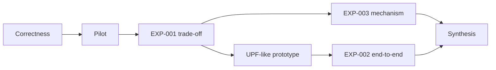

# 🧪 Experiment Hub

> [!abstract]
> **Specification = lời hứa trước dữ liệu. Run = evidence gần-immutable. Analysis = nơi tổng hợp. Claim = wording có boundary.**

## Core sequence

## Experiment cards

> [!todo] EXP-001 — What / where
> [[./EXP-001 - Baseline Throughput and Latency|Dynamic State Trade-off]]
>  
> **Gate:** frozen semantics + pilot + advisor review.

> [!todo] EXP-003 — Why
> [[./EXP-003 - Compact Layout Mechanism Ablation|Compact Layout Mechanism Ablation]]
>  
> **Gate:** one-factor variant diff + reliable counters.

> [!todo] EXP-002 — So what
> [[./EXP-002 - UPF End-to-End Backend Impact|UPF-like End-to-End Backend Impact]]
>  
> **Gate:** packet/rule correctness + identical replay.

## Register

![[./90-dashboards/Experiment Register.base#Experiment Register|90-dashboards/Experiment Register.base > Experiment Register]]

## Quality gate

> [!danger]
> Không chạy “thử xem số bao nhiêu” rồi mới chọn cách kể. Primary outcomes, exclusions, repetitions, thresholds và analysis plan phải freeze trước confirmatory data.

## Guides

- [[./Core Benchmark Protocol|Core Benchmark Protocol]]
- [[./Benchmark Environment and Provenance|Environment and Provenance]]
- [[./README|Run records]]
- [[./README|Analyses]]
- [[./README|Results manifests]]
