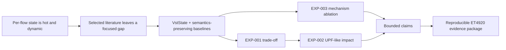
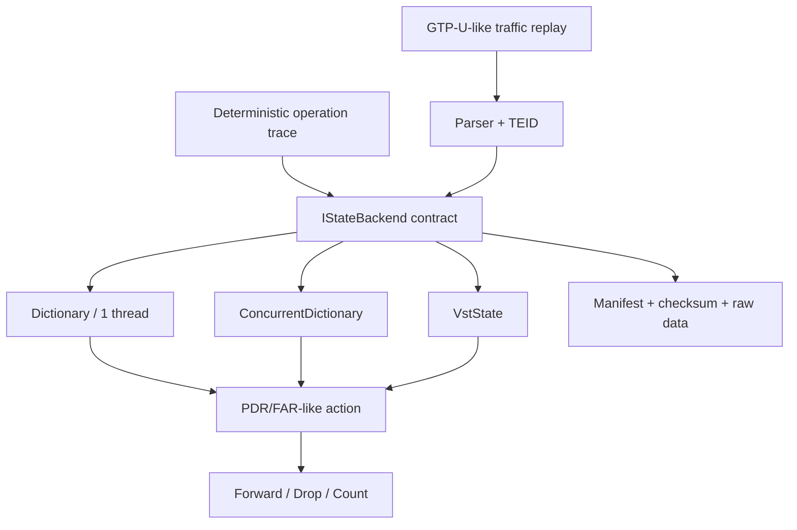
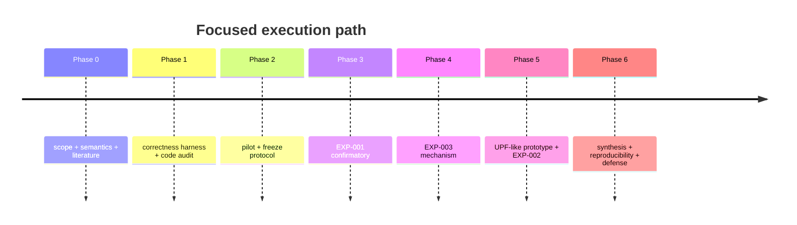

# Project VstState

> [!abstract] Project thesis
> **VstState không được mặc định là “nhanh hơn”.** Đề tài xác định *khi nào* một state store compact trên managed runtime tạo trade-off hữu ích về bộ nhớ, throughput và tail latency so với concurrent hash baseline có cùng semantics; sau đó kiểm tra liệu hiệu ứng đó còn tồn tại trong pipeline UPF-like được kiểm soát hay không.

^project-summary

## Working title

**VI:** Đặc trưng hóa state store bộ nhớ compact cho chức năng mạng có trạng thái động: thiết kế, cơ chế và nghiên cứu trường hợp 5G UPF.

**EN:** Characterizing Compact In-Memory State Stores for Dynamic Stateful Network Functions: Design, Mechanisms, and a 5G UPF Case Study.

## Research argument

## Two primary research questions

1. [[./RQ-01 - Dynamic State Trade-off|RQ-01 — Dynamic state trade-off and mechanism]]
2. [[./RQ-04 - UPF End-to-End Cost|RQ-02 — UPF-like end-to-end impact]]

> [!info] Scope consolidation
> Các câu hỏi cũ về dynamic workload và multi-core đã được gộp thành sub-analysis của RQ-01. [[./RQ-05 - Hybrid Architecture|Hybrid architecture]] là extension, không phải điều kiện tốt nghiệp.

## Defensible contribution package

| ID | Contribution | Evidence required |
|---|---|---|
| C1 | Contract state backend và correctness harness bảo đảm cùng semantics | interface contract, differential tests, concurrent invariants |
| C2 | Characterization có uncertainty của VstState so với baseline công bằng | [[50-experiments/specifications/EXP-001 - Baseline Throughput and Latency|EXP-001]], raw data, scripts |
| C3 | Giải thích ít nhất một cơ chế bằng ablation compact-vs-padded và counters | [[50-experiments/specifications/EXP-003 - Compact Layout Mechanism Ablation|EXP-003]] |
| C4 | Kiểm tra tác động trong pipeline TEID → state → action | [[50-experiments/specifications/EXP-002 - UPF End-to-End Backend Impact|EXP-002]] |
| C5 | Gói tái lập + báo cáo + demo có traceability | [[10-project/deliverables/D-009 - ET4920 Evidence Package|D-009]] |

## Research gap

![[./Related Work and Research Gap#^gap-statement|30-research/Related Work and Research Gap > ^gap-statement]]

> [!caution]
> Gap là kết luận từ **tập tài liệu đã khảo sát**, không phải tuyên bố tuyệt đối “chưa ai từng làm”. Gap phải được cập nhật khi literature review mở rộng.

## Core scope

| Core — phải hoàn tất | Extension — chỉ mở sau core |
|---|---|
| VstState và ConcurrentDictionary cùng semantics | Hybrid index/store |
| Dictionary làm single-thread reference | FASTER/Redis/DPDK/Open5GS baseline |
| 10K, 100K, 1M live states | Dataset lớn hơn RAM |
| lookup-only, read-heavy, churn | Zipf sensitivity, expiry, persistence |
| 1/2/4/8 workers cho concurrent backends | NUMA/SmartNIC/crypto |
| throughput, p99, bytes/live-state | Production-grade UPF |
| một mechanism ablation | Nhiều kiến trúc mới |

## Target system

## Evaluation map

| Question | Experiment | Primary view | Mechanism/validation |
|---|---|---|---|
| RQ-01 | EXP-001 | throughput, p99, bytes/live-state | scaling curve, allocation/GC |
| RQ-01 mechanism | EXP-003 | effect of compact-vs-padded layout | cache/cycle counters |
| RQ-02 | EXP-002 | packet throughput, end-to-end p99 | null-backend ablation, CPU share |

## Definition of excellent

- [x] Hai primary RQ có thể trả lời trong ET4920.
- [x] Baseline/fairness contract được khóa bằng [[./ADR-003 - Baseline Semantics and Fairness|ADR-003]].
- [x] Core experiment có pre-registration cụ thể; chưa giả mạo kết quả.
- [x] Literature gap có nguồn và wording thận trọng.
- [ ] Correctness gate pass trên commit dùng để đo.
- [ ] Pilot noise study hoàn tất; protocol được GVHD duyệt.
- [ ] Confirmatory runs đủ repetitions và có checksum.
- [ ] EXP-003 cung cấp mechanism evidence hoặc ghi rõ inconclusive.
- [ ] UPF-like case study chạy bằng cùng backend contract.
- [ ] Mọi claim link tới analysis + raw data + environment.
- [ ] Có negative results, limitations và threats to validity.
- [ ] Reviewer tái chạy được bằng một command/script.
- [ ] Báo cáo, slide, demo và hướng dẫn vận hành hoàn chỉnh.
- [ ] [[./Excellence Gate - ET4920|Excellence Gate ET4920]] không còn gate đỏ.

## Claim rule

> [!danger] Research integrity
> **Prototype ≠ result. Benchmark ≠ explanation. Correlation ≠ locality mechanism.** Không dùng các từ “faster”, “zero-GC”, “cache-efficient”, “scalable” trong kết luận nếu chưa có đúng loại evidence.

## Roadmap

## Operating context

- [[./Current Handoff|Current Handoff]]
- [[./Research Hub|Research Hub]]
- [[./Core Benchmark Protocol|Core Benchmark Protocol]]
- [[./Benchmark Environment and Provenance|Benchmark Environment]]
- [[./Thesis Outline|Thesis Outline]]
